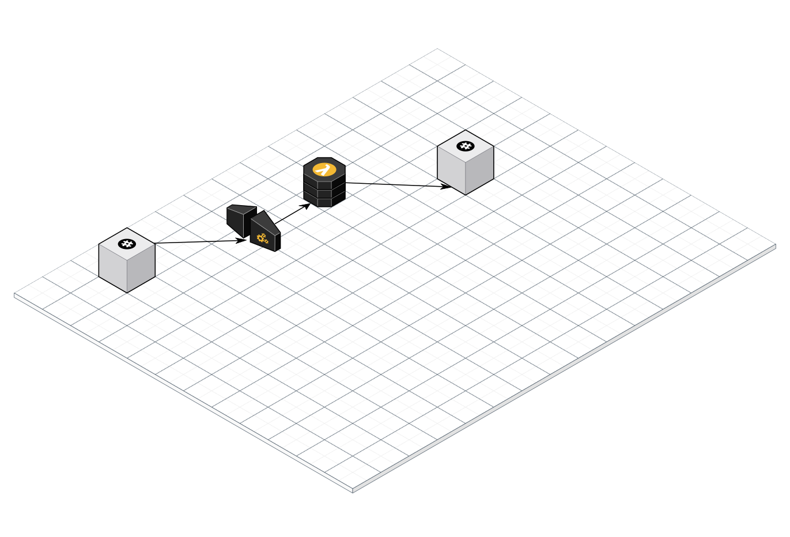

# Slack-emoji-announcer
Posts announcements to a configured slack channel when new emojis are created.

## AWS Infra

## Useful commands

 * `npm run build`   bundles compiled typescript
 * `npm run build:watch`   watch for changes and compile
 * `npm run test`    perform the jest unit tests
 * `cdk deploy`      deploy this stack to your default AWS account/region
 * `cdk diff`        compare deployed stack with current state
 * `cdk synth`       emits the synthesized CloudFormation template
